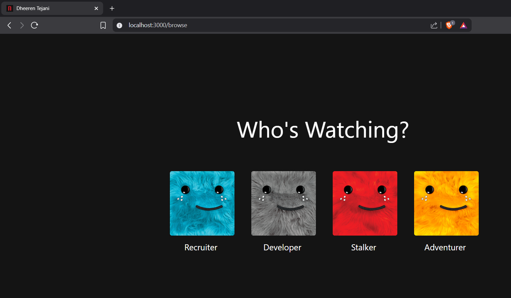

# 🎮 Dheeren Tejani's Portfolio

Welcome to my personal portfolio project! 🚀 This website showcases my work, skills, and experiences in web development. It's designed to be lightweight, modern, and professional while maintaining an approachable style.


---

## ✨ Features

- ⚡ **Fast & Responsive**: Built with modern web technologies for seamless performance
- 🎨 **Modern UI**: Clean and intuitive interface with smooth animations
- 📱 **Fully Responsive**: Works perfectly on all devices and screen sizes
- 🛠️ **Easy to Customize**: Well-structured codebase that's easy to modify
- 📈 **Performance Optimized**: Built with performance and best practices in mind

---

## 🛠️ Tech Stack

This portfolio is built with:

- ⚛️ **React** (Frontend Framework)
- 🔷 **TypeScript** (Type-safe JavaScript)
- 🎨 **Tailwind CSS** (Styling)
- 🚀 **Vite** (Build Tool)
- 🔄 **React Router** (Navigation)
- 🛠️ **GitHub Actions** (CI/CD)
- ☁️ **Netlify** (Hosting & CDN)

---

## ⭐ Show Your Support

If you find this project helpful or inspiring, give it a ⭐ on GitHub—it means the world to me! 🌟

Happy coding! 💻✨

---

## 📚 Getting Started

Want to set this up locally? Follow these steps:

1. **Clone the Repository**: Copy the repository to your local system.
2. **Install Dependencies**: Use a package manager to install the required dependencies.

```bash
nvm install 18
nvm use 18
```

After upgrading Node.js, clear your node_modules and reinstall:

```bash
rm -rf node_modules
npm cache clean --force
npm install
```

3. **Configure Environment Variables**: Create a `.env` file and set up the necessary API keys and configurations.
4. **Run the Project**: Start the development server.

```bash
npm start
```

5. **Visit the Local Server**: Open your browser and navigate to the local server URL.
   

---

## 🤝 Contribution Guidelines

Contributions are welcome and appreciated! 🥳 To contribute:

1. Fork the repository.
2. Create a new branch for your feature or fix.
3. Commit your changes with a descriptive message.
4. Push your changes to your branch.
5. Open a Pull Request. 🎉

---

## 🐛 Issues and Feature Requests

Found a bug? Have a feature in mind? 🤔 Feel free to raise an issue or suggest a feature!

1. Go to the **Issues** tab in the repository.
2. Click **New Issue**.
3. Provide a clear description of the bug or feature request.
4. If applicable, include screenshots or steps to reproduce the issue.

Your feedback is valuable and helps make this project better for everyone. Thank you for contributing!

---

## 🌟 Acknowledgments

- This project was inspired by the original work of [Sumanth Samala](https://github.com/SamalaSumanth0262).
- Grateful to the open-source community for their invaluable contributions. 💻
- Special thanks to all contributors who helped improve this project! 🚀

---

## 📧 Contact Me

- 💼 [My Portfolio](https://dheerentejani.netlify.app/)
- 📧 Email: [dheerennntejani@gmail.com](mailto:dheerennntejani@gmail.com)
- 🔗 [LinkedIn](https://www.linkedin.com/in/dheeren-tejani)

---

## 📜 License

This project is licensed under the MIT License. Feel free to use it, modify it, and share it! 🌈

---
